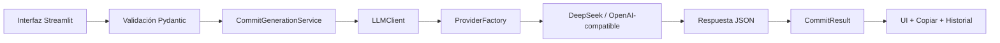

# Commit Writer

<p align="center">
  Convierte descripciones de cambios en commits claros, consistentes y listos para copiar.
</p>

<p align="center">
  
  
  
  
</p>

## Resumen

Commit Writer es una app web ligera para transformar texto informal o técnico en mensajes de commit útiles. La interfaz es bilingüe, detecta el idioma del navegador y permite cambiarlo con un switch manual cuando lo necesites.

La app incluye historial local opcional, selección de estilo, scope, formalidad, alternativas de salida y un flujo preparado para múltiples proveedores LLM.

## Lo más útil de un vistazo

| Función | Detalle |
| --- | --- |
| Idiomas | Interfaz bilingüe ES/EN con switch manual |
| Estilos | Conventional, simple English, simple Spanish, formal business, gitmoji y release notes |
| Salida | Commit recomendado, alternativas, explicación y SemVer sugerido |
| Historial | Guardado opcional en SQLite |
| LLM | Arquitectura compatible con múltiples proveedores |
| UX | Copiar al portapapeles, validaciones y mensajes claros |

## Características

- Genera mensajes de commit desde lenguaje natural.
- Soporta Conventional Commits.
- Ofrece estilos simples, formales, gitmoji y release notes.
- Detecta el idioma de la interfaz por navegador.
- Permite cambiar el idioma manualmente con un switch.
- Inferencia del tipo de cambio cuando se usa `automático`.
- Scope opcional.
- Nivel de formalidad.
- 1, 3 o 5 alternativas.
- Explicación breve del resultado.
- Sugerencia SemVer conservadora.
- Comando `git commit -m "..."` listo para copiar.
- Advertencias cuando la descripción es ambigua.
- Historial local opcional con SQLite.
- Arquitectura preparada para varios proveedores LLM.

## Stack

- Python 3.11+
- Streamlit
- Pydantic
- python-dotenv
- OpenAI SDK para proveedores OpenAI-compatible
- SQLite para historial local

## Vista general



## Estructura del proyecto

```text
commit-writer/
├── app.py
├── README.md
├── README.es.md
├── requirements.txt
├── .env.example
├── models/
├── prompts/
├── services/
├── storage/
└── utils/
```

## Instalación

1. Clona o descarga el proyecto y entra en la carpeta.

```bash
cd commit-writer
```

2. Crea un entorno virtual.

```bash
python -m venv venv
```

3. Activa el entorno virtual.

macOS/Linux:

```bash
source venv/bin/activate
```

Windows:

```bash
venv\\Scripts\\activate
```

4. Instala dependencias.

```bash
pip install -r requirements.txt
```

## Configuración

1. Copia el archivo de ejemplo.

```bash
cp .env.example .env
```

2. Edita `.env` con tu API key y proveedor.

### Ejemplo con DeepSeek

```env
LLM_PROVIDER=deepseek
LLM_API_KEY=sk-your-deepseek-key
LLM_MODEL=deepseek-v4-flash
LLM_BASE_URL=https://api.deepseek.com
LLM_TEMPERATURE=0.2
LLM_TIMEOUT=30
LLM_MAX_TOKENS=1200
LLM_JSON_MODE=true
HISTORY_ENABLED=true
```

### Ejemplo OpenAI-compatible

```env
LLM_PROVIDER=custom_openai_compatible
LLM_API_KEY=your-api-key
LLM_MODEL=model-name
LLM_BASE_URL=https://your-provider-base-url.example/v1
LLM_TEMPERATURE=0.2
LLM_TIMEOUT=30
LLM_MAX_TOKENS=1200
LLM_JSON_MODE=true
HISTORY_ENABLED=true
```

### Proveedores preparados

- `deepseek`
- `openai`
- `openrouter`
- `together`
- `groq`
- `custom_openai_compatible`

## Ejecución local

```bash
streamlit run app.py
```

Luego abre la URL local que muestre Streamlit.

## Ejemplos de uso

### Entrada

```text
cambié el readme para que redirija a la última release
```

### Salida esperada

```bash
docs(readme): redirect downloads to latest release
```

### Entrada

```text
corregí un error en el formulario de login
```

### Salida esperada

```bash
fix(auth): resolve login form error
```

### Entrada

```text
mejoré el rendimiento de la consulta de usuarios
```

### Salida esperada

```bash
perf(users): optimize user query performance
```

## Historial local

El historial usa SQLite y se guarda en:

```text
storage/commit_history.sqlite3
```

Para desactivarlo:

```env
HISTORY_ENABLED=false
```

El historial guarda:

- Fecha de generación.
- Descripción original.
- Estilo seleccionado.
- Idioma de salida.
- Tipo seleccionado.
- Scope.
- Commit recomendado.
- Alternativas.
- Sugerencia SemVer.

## Validaciones incluidas

- La descripción es obligatoria.
- Mínimo 8 caracteres.
- Máximo 1000 caracteres.
- El scope no puede contener espacios.
- El número de alternativas solo puede ser 1, 3 o 5.
- El tipo de cambio debe pertenecer a la lista permitida.
- El estilo de commit debe pertenecer a la lista permitida.
- El idioma de salida debe ser español o inglés.
- La respuesta del LLM debe ser JSON válido.
- La estructura de respuesta se valida con Pydantic.

## Flujo interno

```text
Streamlit UI
→ CommitGenerationService
→ LLMClient
→ ProviderFactory
→ BaseLLMClient
→ DeepSeekClient u OpenAICompatibleClient
→ Respuesta JSON
→ CommitResult
→ UI
```

## Notas de diseño

- La UI está pensada para priorizar velocidad de uso.
- El historial local es opcional y no interfiere con la generación.
- La arquitectura evita concentrar la lógica en `app.py`.
- Los mensajes y respuestas siguen el idioma activo de la interfaz.

## Futuras mejoras

- Generador de nombres de ramas.
- Generador de changelog.
- Generador de release notes avanzado.
- Generador de pull request title.
- Generador de pull request description.
- Integración con GitHub.
- Lectura de `git diff`.
- Extensión de VS Code.
- API pública con FastAPI.
- Exportar historial.
- Perfiles por proyecto.
- Estilos personalizados.