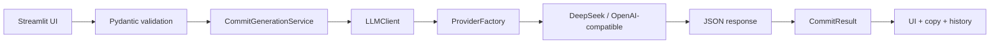

# Commit Writer

<p align="center">
    Turn change descriptions into clean, consistent commit messages that are ready to copy.
</p>

<p align="center">
    
    
    
    
</p>

🌐 También disponible en: [Español](README.es.md).

## Overview

Commit Writer is a lightweight web app for turning informal or technical change descriptions into useful commit messages. The interface is bilingual, detects the browser language, and lets you switch manually when needed.

The app includes optional local history, style selection, scope, formality, multiple output alternatives, and a pipeline that is ready for multiple LLM providers.

## Quick Look

| Feature | Details |
| --- | --- |
| Languages | Bilingual EN/ES interface with manual switch |
| Styles | Conventional, simple English, simple Spanish, formal business, gitmoji, and release notes |
| Output | Recommended commit, alternatives, explanation, and suggested SemVer |
| History | Optional SQLite-based local history |
| LLM | Compatible architecture for multiple providers |
| UX | Clipboard copy, validation, and clear feedback |

## Features

- Generate commit messages from natural language.
- Support for Conventional Commits.
- Simple, formal, gitmoji, and release-note styles.
- Browser-based interface language detection.
- Manual language switching with a dedicated toggle.
- Automatic change type inference when `automatic` is used.
- Optional scope.
- Formality level selection.
- 1, 3, or 5 alternatives.
- Short explanation of the chosen output.
- Conservative SemVer suggestion.
- Ready-to-copy `git commit -m "..."` command.
- Warnings when the description is ambiguous.
- Optional local history stored in SQLite.
- Architecture prepared for multiple LLM providers.
- Sidebar indicator showing the connected provider and model, or a clear "No API connected" notice when no API key is set.

## Stack

- Python 3.11+
- Streamlit
- Pydantic
- python-dotenv
- OpenAI SDK for OpenAI-compatible providers
- SQLite for local history

## Architecture



## Project Structure

```text
commit-writer/
├── app.py
├── README.md
├── README.es.md
├── requirements.txt
├── .env.example
├── models/
├── prompts/
├── services/
├── storage/
└── utils/
```

## Installation

1. Clone or download the project and enter the folder.

```bash
cd commit-writer
```

2. Create a virtual environment.

```bash
python -m venv venv
```

3. Activate the virtual environment.

macOS/Linux:

```bash
source venv/bin/activate
```

Windows:

```bash
venv\Scripts\activate
```

4. Install dependencies.

```bash
pip install -r requirements.txt
```

## Configuration

1. Copy the example environment file.

```bash
cp .env.example .env
```

2. Edit `.env` with your API key and provider settings.

### DeepSeek example

```env
LLM_PROVIDER=deepseek
LLM_API_KEY=sk-your-deepseek-key
LLM_MODEL=deepseek-v4-flash
LLM_BASE_URL=https://api.deepseek.com
LLM_TEMPERATURE=0.2
LLM_TIMEOUT=30
LLM_MAX_TOKENS=1200
LLM_JSON_MODE=true
HISTORY_ENABLED=true
```

### OpenAI-compatible example

```env
LLM_PROVIDER=custom_openai_compatible
LLM_API_KEY=your-api-key
LLM_MODEL=model-name
LLM_BASE_URL=https://your-provider-base-url.example/v1
LLM_TEMPERATURE=0.2
LLM_TIMEOUT=30
LLM_MAX_TOKENS=1200
LLM_JSON_MODE=true
HISTORY_ENABLED=true
```

### Supported providers

- `deepseek`
- `openai`
- `openrouter`
- `together`
- `groq`
- `custom_openai_compatible`

## Run Locally

```bash
streamlit run app.py
```

Then open the local URL shown by Streamlit.

## Deployment

Configuration is read from Streamlit secrets first and falls back to environment variables, so the app runs both locally (`.env`) and on Streamlit Community Cloud (secrets) without code changes.

### Streamlit Community Cloud

1. Push the repository to GitHub. The `.env` file is gitignored and is not uploaded.
2. Create a new app at [share.streamlit.io](https://share.streamlit.io) pointing to `app.py`.
3. In **App settings → Secrets**, add your configuration in TOML format:

```toml
LLM_PROVIDER = "deepseek"
LLM_API_KEY = "sk-your-key"
LLM_MODEL = "deepseek-v4-flash"
LLM_BASE_URL = "https://api.deepseek.com"
HISTORY_ENABLED = "false"
```

The sidebar reflects the connected provider and model; when no `LLM_API_KEY` is set it shows a generic "No API connected" notice.

> Note: the local SQLite history is not persisted on Streamlit Community Cloud because the filesystem is ephemeral. Set `HISTORY_ENABLED = "false"` to avoid confusion, or use a platform with a persistent disk.

## Usage Examples

### Input

```text
I changed the README so downloads go to the latest release
```

### Expected output

```bash
docs(readme): redirect downloads to latest release
```

### Input

```text
I fixed a bug in the login form
```

### Expected output

```bash
fix(auth): resolve login form error
```

### Input

```text
I improved the performance of the user query
```

### Expected output

```bash
perf(users): optimize user query performance
```

## Local History

The history is stored in SQLite at:

```text
storage/commit_history.sqlite3
```

To disable it:

```env
HISTORY_ENABLED=false
```

The history stores:

- Generation date.
- Original description.
- Selected style.
- Output language.
- Selected change type.
- Scope.
- Recommended commit.
- Alternatives.
- SemVer suggestion.

## Built-In Validation

- Description is required.
- Minimum length: 8 characters.
- Maximum length: 1000 characters.
- Scope cannot contain spaces.
- Alternatives can only be 1, 3, or 5.
- Change type must be one of the allowed values.
- Commit style must be one of the allowed values.
- Output language must be English or Spanish.
- The LLM response must be valid JSON.
- The response structure is validated with Pydantic.

## Internal Flow

```text
Streamlit UI
→ CommitGenerationService
→ LLMClient
→ ProviderFactory
→ BaseLLMClient
→ DeepSeekClient or OpenAICompatibleClient
→ JSON response
→ CommitResult
→ UI
```

## Design Notes

- The UI is optimized for speed.
- Local history is optional and does not block generation.
- Business logic stays out of `app.py`.
- Messages and responses follow the active interface language.

## Future Improvements

- Branch name generator.
- Changelog generator.
- Advanced release notes generator.
- Pull request title generator.
- Pull request description generator.
- GitHub integration.
- `git diff` ingestion.
- VS Code extension.
- Public FastAPI endpoint.
- Export history.
- Project profiles.
- Custom styles.

## License

This project is licensed under the [MIT License](LICENSE).
